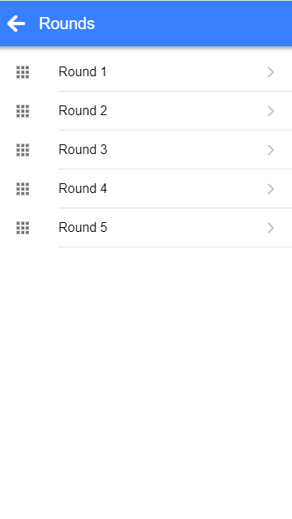

# Chess Tournament

This is the UI for https://chessclub.io.  It relies on the Chess Tournament web API for the backend.  





## Project setup
```
npm install
```

### Compiles and hot-reloads for development
```
npm run serve
```

### Compiles and minifies for production
```
npm run build
```

### Run your tests
```
npm run test
```

### Lints and fixes files
```
npm run lint
```

