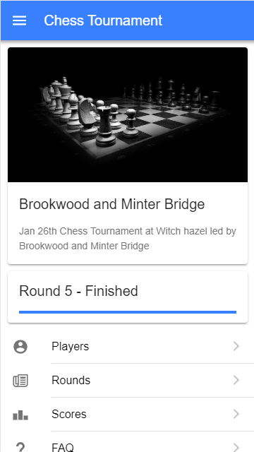
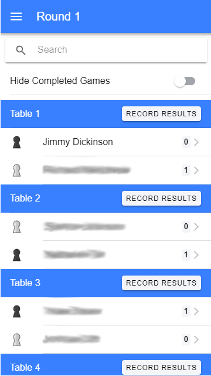
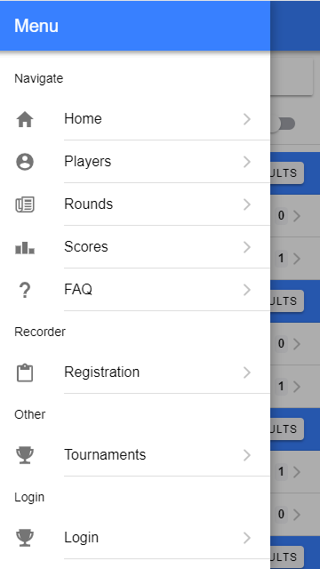

# Chess Tournament

This is the UI for https://chessclub.io.  It relies on the Chess Tournament web API for the backend.  

Currently several local schools are using chessclub.io.

The tournament software is a web based and mobile optimized solution needed for our growing tournaments. After volunteering to run the pairings and scoring for local grade school chess club tournaments, we ran into multiple bottlenecks.  We tried different softwares and none could support larger groups than 50 without delaying the tournaments timeline even with multiple scorekeepers.  

This project is designed to be a web based solution designed for mobile and tables that allows multiple scorekeepers to enter scores at the same time.  The software allows for quick corrections by coaches and exception without halting the full tournament.  The parents could also see their children's scores in real time.  

We have ran multiple tournaments with 200+ students all of which ended on time or ahead of schedule. The tournament have also moved to paperless and without cables. All registration, score keeping and pairing were done on mobile devices or tablets.  Push notification all for quick and seamless round transitions and communication.

Other tournament software had limited pairing algorithms. The new system took into account grade, school, previously played opponents, and ELO ranking and rating. All the weights can be adjusted on the fly as seen fit by the chess club coaches. Once pairing are created, the students start finding their next table via the app and a text message, often even before we announce a new round.  FIDE ratings are not connected to the internal system at this time.





## Project setup
```
npm install
```

### Compiles and hot-reloads for development
```
npm run serve
```

### Compiles and minifies for production
```
npm run build
```

### Run your tests
```
npm run test
```

### Lints and fixes files
```
npm run lint
```

